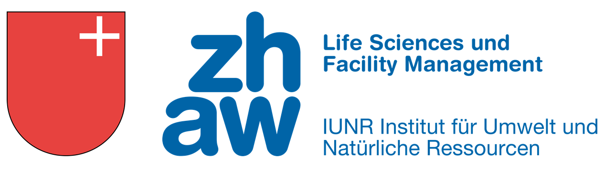

--- 
title: ""

date: "Wadenswil, Version vom `r Sys.Date()`"

site: bookdown::bookdown_site
documentclass: book

lang: de        

always_allow_html: true
---

```{r eval=FALSE, echo = FALSE, warning = FALSE, message = FALSE, cache = FALSE}
# to preview the book
# run in console
library(bookdown)
library(servr)

serve_book(dir = ".", output_dir = "_book", preview = TRUE, in_session = TRUE, quiet = FALSE)

# open link with browser:
http://127.0.0.1:4321

# To stop the server, run 
servr::daemon_stop(1) 
```

# Informationen zum Besuchermonitoring am Höhronen {-}

```{r include=FALSE}
library(bookdown)  # to create the book
library(servr)     # to preview the book

knitr::opts_chunk$set(echo = FALSE, warning = FALSE, message = FALSE, cache = FALSE, fig.align="left")
```

```{r out.width = "80%", fig.align ="center"}

```

## Liebe Bikerinnen und Biker {-}

Diese automatische optische Kamera dient zur Zählung von Outdooraktivitäten. Diese Aktion ist Teil eines Forschungsprojekts an der Zürcher Hochschule für Angewandte Wissenschaften (ZHAW) und des Kantons Schwyz (Wildhüter Matthias Oechslin) in Zusammenarbeit mit der Waldkorporation Wollerau (Betriebsfördter Pirmin Schuler). Das Ziel dieses Projekts ist die Förderung eines naturorientierten Outdoorsports.

## Datenschutz {-}

Dieses Zählgerät erfasst keine Personendaten. Durch eine automatische Weichzeichnung der Kamerabilder können Gesichter und Personen nicht erkannt werden. Die Bilder werden nach der Bearbeitung gelöscht und der Zugang zur Kamera ist mit Code und Schloss gesichert. 

```{r out.width = "100%", fig.align ="center"}

```

## Kontakt {-}

Gerne stehen wir bei Fragen zu dem Monitoring zur Verfügung

adrian.hochreutener@zhaw.ch

Forschungsgruppe Umweltplanung, ZHAW

https://www.zhaw.ch/de/lsfm/institute-zentren/iunr/geooekologie/umweltplanung/


